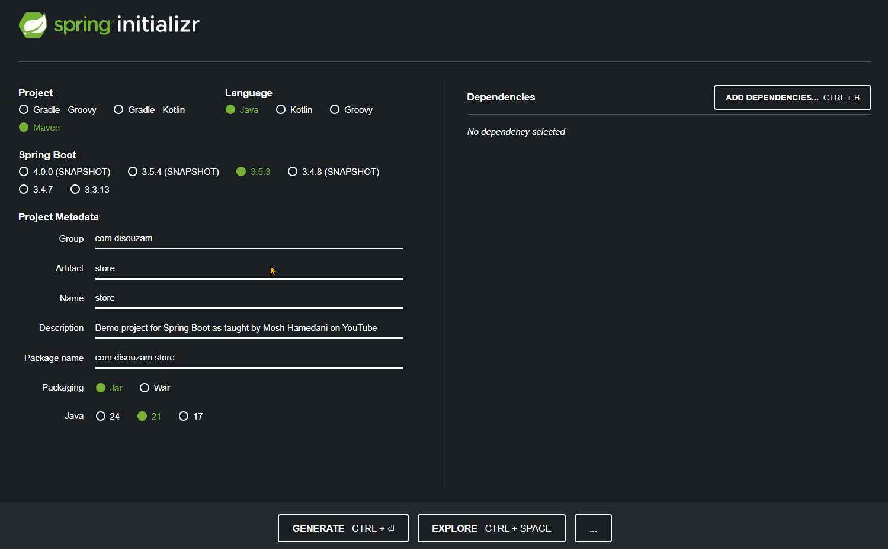
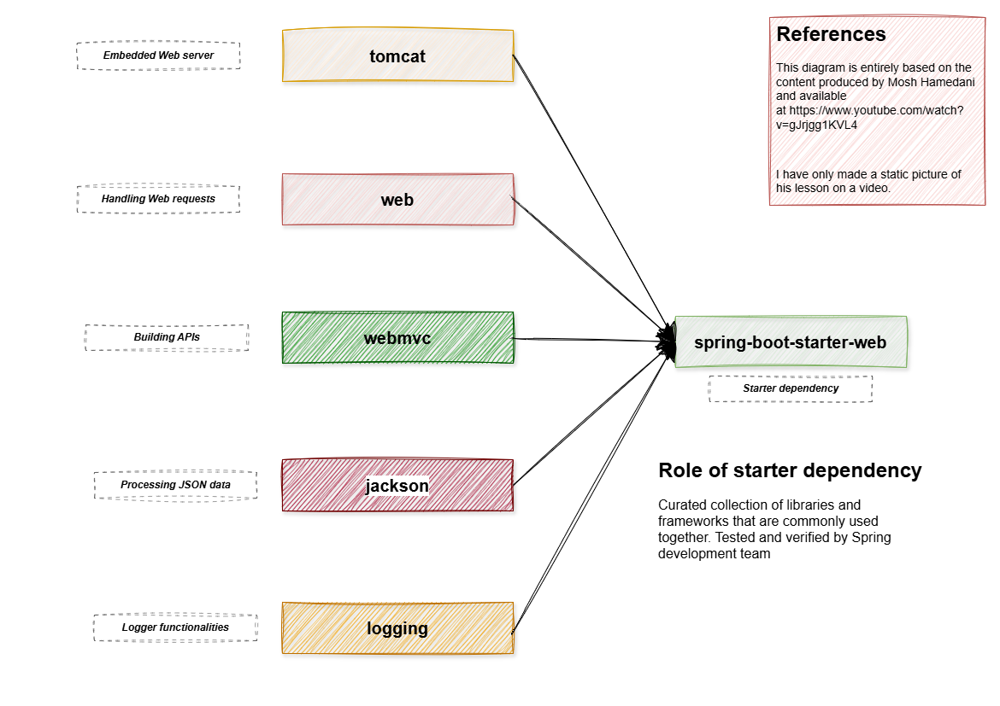
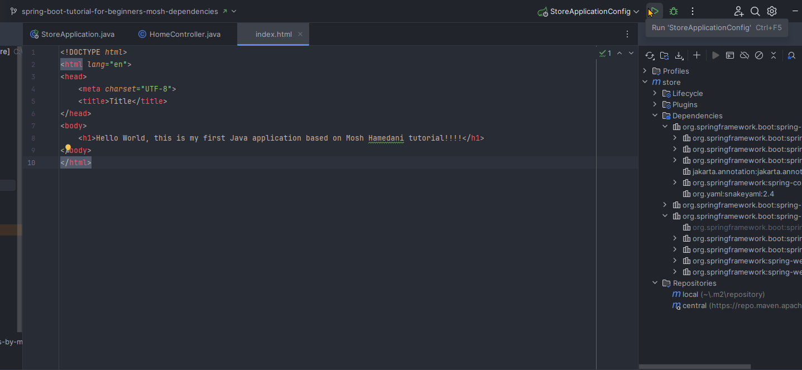

# Sobre esse repositório

Esse repositório contém códigos apresentados nas lições do tutorial de 1 hora do Mosh Hamedani (canal Programming with Mosh), disponível no YouTube em [Spring Boot Tutorial for Beginners [2025]](https://www.youtube.com/watch?v=gJrjgg1KVL4)

O código-fonte do próprio Mosh Hamedani está disponível em [spring-store](https://github.com/mosh-hamedani/spring-store). E cada um de seus commits corresponde a uma lição de seu curso.

## Iniciando...

O diagrama abaixo, reproduzido do vídeo do Mosh Hamedani citado acima, resume as principais idéias por trás do framework Spring e da relação com o Spring Boot. Parafraseando o Mosh, o Spring Boot veio para facilitar a adoção do Spring por meio de uma série de recursos prontos ou pré-configurados.


## JDK

Para esse tutorial, irei adotar o JDK Correto fornecido pela Amazon e usarei a versão 21.0.7, disponível em: [Amazon Corretto 21 Installation Instructions for Windows 10 or Later](https://docs.aws.amazon.com/corretto/latest/corretto-21-ug/windows-install.html). Outros Java Development Kits estão disponíveis, alguns gratuitos como o Corretto e outros sujeitos a licenciamento, mas não discutirei as implicações nem diferenças aqui. Recomendo um excelente resposta sobre o assunto no Stack Overflow: [Several vendors offer a choice of Java implementations](https://stackoverflow.com/questions/58250782/which-free-version-of-java-can-i-use-for-production-environments-and-or-commerci/58260110#58260110)

O comando `java -version` produz o seguinte resultado no meu computador:

```shell
openjdk version "21.0.7" 2025-04-15 LTS
OpenJDK Runtime Environment Corretto-21.0.7.6.1 (build 21.0.7+6-LTS)
OpenJDK 64-Bit Server VM Corretto-21.0.7.6.1 (build 21.0.7+6-LTS, mixed mode, sharing)
```

## IDE

Graças à disponibilidade de licença de estudante para o IntelliJ Idea Ultimate, essa será a IDE escolhida para esse trabalho mas tentarei replicar os resultados e testes também no Eclipse

## Ferramentas de Build

Dentre as duas ferramentas mais populares de build, será adotado o Maven por sua popularidade.

Maven já havia sido instalado em meu computador em outra ocasião pelo caminho sugerido pelo Mosh no vídeo: usando o Chocolatey para efetuar o download e instalação: 
- [Installing Chocolatey](https://chocolatey.org/install?_gl=1*1gzkr8j*_ga*MTc0Mjc5MTE1OS4xNzUxMjI3NTk4*_ga_0WDD29GGN2*czE3NTEyMjc1OTgkbzEkZzEkdDE3NTEyMjc3MjMkajMzJGwwJGgw)
- [Apache Maven](https://maven.apache.org/install.html)

O resultado do comando `mvn -v` está mostrado abaixo, com alguns trechos removidos:

```shell
Apache Maven 3.9.10 (5f519b97e944483d878815739f519b2eade0a91d)
Maven home: {...}\apache-maven-3.9.10
Java version: 21.0.7, vendor: Amazon.com Inc., runtime: {...}\corretto-21.0.7
Default locale: pt_BR, platform encoding: UTF-8
OS name: "windows 11", version: "10.0", arch: "amd64", family: "windows"
```

## Criação do primeiro projeto

A criação do projeto será executada por meio da ferramenta disponível no site [start.spring.io](start.spring.io) conforme apresentado na imagem abaixo:



## Dependências para começar o projeto

O uso de uma dependência como a `spring-boot-starter-web` permite incluir várias dependências usadas regularmente em conjunto de uma só vez. O papel das dependências que compõem o spring-boot-starter-web (ou parte dele) é melhor explicado pelo diagrama abaixo que mostra que várias bibliotecas relevantes são incluidas junto com o starter-web.



## Como executar o projeto

Para executar o projeto, que dispõe, momentaneamente de uma controladora `Home` e uma página estática HTML no diretório `resources`, há duas formas principais:

1. Diretamente a partir de configuração criada no IntelliJ Idea Ultimate



2. Ou por meio da linha de comando e dos wrappers já fornecidos pelo Spring Initializr

```shell
./mvnw spring-boot:run
```

Em ambos os casos, em seguida abra o browser de sua preferência e digite a seguinte URL: [http://localhost:8080/](http://localhost:8080/)